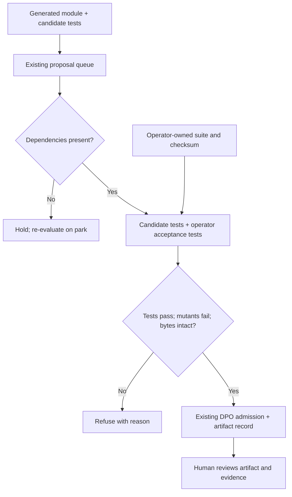

# Grok Bot + OSAHR: product decision and first implementation

Status: proposed product direction; implementation is a local prototype.
Product owner: @sdcarlson (issue #13). Product-picture author: @sykosyber (issue #15).
This plan records Seth's subsequent instruction to solidify the direction and
begin a bounded implementation. It does not represent a PI decision to ship a
platform integration. No customer, pilot, or measured advantage is implied.

## Product decision

Build toward a workflow in which an operator can review and accept a generated
Python component against independently owned requirements, with an inspectable
record of what was tested. Grok Bot supplies the interaction and generation;
OSAHR supplies legal construction, dependency holds, and recorded decisions.
First proposed operator: a software maintainer reviewing generated components.
First proposed recurring decision: whether an exact candidate satisfies the
maintainer's acceptance contract and is ready for human review.

The immediate value hypothesis is less review effort and fewer incorrect
acceptances. The broader vision adds legal sequencing across specialists. That
sequencing must demonstrate value against a simple dependency workflow before
we expand it. We are not replacing platform approval with a local test result.

## Reconcile #13 and #15

| Concern | Decision |
|---|---|
| #13 | Retain as the product-validation responsibility owned by Seth. This document proposes its updated scope; it does not edit the issue. |
| #15 | Governs the proposed Grok Bot + OSAHR picture. It is not evidence of customer demand or integration readiness. |
| NetworkBrain first wedge | Superseded as the first product. Preserve the merged workbench from PR #14 and its packet laws within their original scope. It is not a prerequisite for this slice. |
| Claim discipline | Keep KNOWN / MEASURED / INFERRED / PROPOSED separate from action permission. Experiment 06 remains the last confirmatory record. |
| Customer validation | Preserve real cases, concierge before UI, repeat use, and committed demand. Internal tests are not customer validation. |
| Interaction | Use the existing Bot interface eventually. No competing chat/dashboard or specialist mesh. Solo remains the initial workflow. |
| Construction | Owners stay in runtime memory; only existing legal DPO construction changes the graph. Kernel and experiments are untouched. |
| Existing gate checkboxes | Historical workbench completion does not transfer to the new product. Re-establish the job and external validation. |

The old three-user commitment gate and the new five-external-run gate differ.
Proposed reconciliation: first obtain one external operator's case and second-run
commitment; then require five externally grounded runs and three users' repeat or
equivalent commitments before a broader product investment. A paid/formal pilot
remains a commercialization criterion. These thresholds are proposed, not silently
declared satisfied or agreed by both issue owners.

Repository check: `main` at `df38bdc` includes merged PR #14 (workbench)
and PR #16 (admission and snapshot hardening). This slice builds on both.
Their tests establish prototype behavior, not external product validation.

## Why this first slice

The current live proposal includes both `module` and `tests`. Runner-owned
`verified` prevents a caller Boolean from licensing admission, but a mutually
wrong module and test can pass and kill the simple mutant. Therefore passing the
current gate does not demonstrate an independently specified behavior.

Add one mandatory operator-owned acceptance gate for generated payloads. It is
the first red-team hole in #15 that can be addressed locally without inventing a
platform integration. Keep the existing candidate tests as a supplemental gate.
Do not expand into skill rails, HTTP MCP, a second artifact type, a mesh, CTMC,
new kernel semantics, autonomous actuation, or a new model.

## System design and trust boundary

### Contract

- The process operator configures `GROKCELL_ACCEPTANCE_DIR`. There is no tool for
  registering suites and no payload field that chooses a suite path or checksum.
- Each component has `<root>/<component>/test_acceptance.py` and
  `test_acceptance.sha256` (SHA-256 of the exact UTF-8 test bytes).
- Missing configuration/suite yields `outcome_unknown`; invalid or changed
  contents yield refusal. No fallback to candidate-authored tests alone.
- Read and verify the suite before executing the generated candidate. Evaluate
  a snapshot of those test bytes with the exact candidate module in a fresh
  directory. Candidate-authored tests do not participate in the acceptance run.
- Both the candidate suite and the acceptance suite must pass and kill the
  existing AST mutant. Timeouts, infrastructure failures, missing tests, and
  modified staged bytes never count as a killed mutant.
- The admitted record binds the artifact content hash to the acceptance-suite
  hash. Source for the operator tests is not copied into the exported artifact.
  Existing file-act stamps retain that metadata.
- Existing fidelity records still describe candidate-suite execution; they are
  not independent acceptance or admission records. Only the classifier combines
  both gates before materialization. A failed acceptance run may leave a passing
  candidate fidelity record, but never an admitted component or artifact.
- Held messages use the current operator contract when they become eligible,
  including after restart. Previously admitted artifacts retain the contract
  digest used at admission; changing a suite does not retroactively re-license
  or revoke them. Existing immutable component-name/conflict semantics remain.
- Frozen repository scenarios retain their existing runner/fidelity behavior.
  Generated payloads targeting a frozen component are rejected as reserved names,
  preserving the hardening introduced in PR #16.

### Honest limits

This separates authorship and selects the oracle outside the proposal. It does
not make tests secret: the candidate and tests execute on the same host. Anyone
with host write access can alter configuration and evidence; a checksum is an
integrity check against a supplied pin, not authentication. Arbitrary Python can
attack the test process. The existing unsafe-development opt-in remains required;
we run only trusted test fixtures here. This slice adds no OS sandbox.

Mutation testing covers the existing simple returned-constant mutation, not
general correctness. `admit` means passed these prototype gates, not safe to
deploy. Park file actions are local artifact operations/stamps; they do not
control external publishing, email, payments, or another shell path. Kernel
integrity and session identity do not establish platform isolation.

## Methodology and acceptance criteria

1. Record the current GrokCell regression baseline.
2. Add a regression where a wrong module and matching wrong tests pass the old
   candidate gate but fail independently specified acceptance criteria.
3. Implement the acceptance gate through the existing classifier, reused by
   drain and held-message release. Keep all kernel changes out of scope.
4. Verify unknown/malformed/tampered suites, priority and constraint bypass
   attempts, forged payload metadata, mutation failure, runner failures, exact
   bytes, restart/hold behavior, and durable evidence.
5. Run GrokCell, kernel, and merged workbench regressions. Review the diff for
   correctness and unnecessary abstractions. Publish directly to `main` with a
   non-force update, as subsequently authorized by Seth. Repository publication
   does not authorize a platform integration or deployment.

Rollback is to revert this surface-only change. Legacy records remain readable.
Do not roll back to candidate-only evaluation while advertising independent
acceptance. Keep the process single-host and prototype-scoped.

## Next gates, with stop conditions

| Gate | Evidence / deliverable | Stop condition |
|---|---|---|
| This implementation | Independent acceptance gate and adversarial regressions | Any generated proposal can obtain admission from its own tests alone |
| External workflow | Named maintainer, real case, current review time/failure cost, acceptance contract, second-run commitment | No real case or repeat interest: revise the job; no additional infrastructure |
| Isolated evaluation | Platform-approved execution environment; operator-controlled evaluation inaccessible to candidate tampering | Shared-host execution cannot support a hostile-code assurance claim |
| Actual action control | Named action and platform-owned path that cannot bypass refusal; approval bound to exact artifact/version | No controllable path: keep an advisory offer or stop the enforcement claim |
| Product validation | Five external runs, three repeat/equivalent commitments, measured review effort and false acceptance/refusal vs existing process | No benefit over a simple gate/workflow: delete the extra coordination scope |

Seth owns the product record and validation follow-through. The independent
acceptance contract must be owned by the real maintainer once one participates.
The platform must own the eventual isolation and write boundary. No external
person is treated as committed merely because this plan names their role.

Sources: [#13](https://github.com/SyberLabs/OSAHR_Cell/issues/13),
[#15](https://github.com/SyberLabs/OSAHR_Cell/issues/15),
`research_directions/08_next_steps.txt`, `research_directions/12_grokcell_production.txt`.
The #15-linked `research_directions/14_one_shot_machine.txt` was absent from
`main` at base commit `fb366a5`; the full issue comments supply that report.
